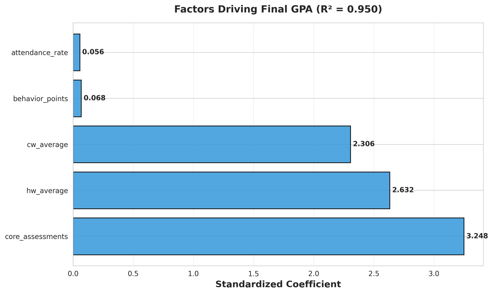
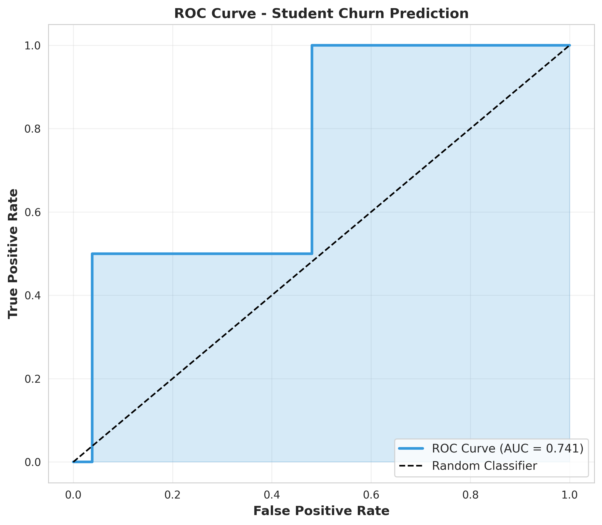
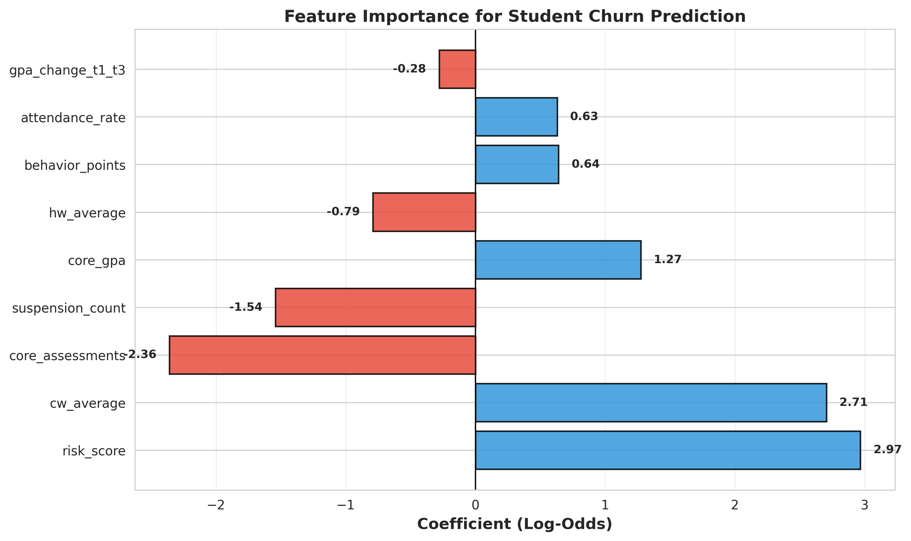

# Student Performance Analysis and Retention Risk Modeling

A quantitative analysis of middle school student performance data to identify at-risk students and understand the key drivers of academic outcomes.

---

## Project Overview

**Context**: Analysis of Grade 6-7 student performance data from a middle school cohort (N=347 students, 1,047 student-term observations across three terms).

**Objective**: 
- Identify factors that significantly impact student academic performance
- Develop a systematic framework for early identification of at-risk students
- Provide empirical evidence to support resource allocation decisions

**Scope**: Independent project encompassing data collection, preprocessing, statistical analysis, and predictive modeling.

---

## Methodology

### 1. Data Preparation
**File**: `01_data_cleaning.py`

- Integrated six data sources: term-level academic records (T1, T2, T3), annual GPA data, and withdrawal records
- Addressed data quality issues including missing values, inconsistent grade labels, and duplicate records
- Created derived features: attendance rate, GPA change metrics (term-over-term and cumulative)
- Final dataset: 347 students with complete academic, behavioral, and attendance records

### 2. Risk Assessment Framework
**File**: `02_kpi_analysis.py`

Developed a five-factor risk scoring system (0-5 scale) based on:
- Academic performance: GPA below 25th percentile, consecutive GPA decline
- Behavioral indicators: low behavior points, suspension records
- Attendance: attendance rate below 25th percentile

Risk classification:
- Level 0 (0-1 points): Normal
- Level 1 (2 points): Requires monitoring
- Level 2 (3 points): Moderate risk
- Level 3 (4-5 points): High risk

### 3. Factor Analysis
**File**: `03_regression_analysis.py`

**Objective**: Identify which factors drive academic performance and GPA growth across different time periods.

**Approach**: Multiple linear regression with standardized coefficients to enable direct comparison of factor importance.

**Three models**:
1. Annual model: Predicting final GPA using full-year averages of homework, classwork, assessments, behavior, and attendance
2. T1→T2 model: Predicting Term 1 to Term 2 GPA change using Term 1 metrics
3. T2→T3 model: Predicting Term 2 to Term 3 GPA change using Term 2 metrics

### 4. Withdrawal Prediction Model
**File**: `04_predictive_model.py`

**Model**: Logistic regression with class balancing to address low withdrawal rate (5.8%)

**Features**: 9 variables including GPA, homework/classwork averages, assessment scores, behavioral metrics, attendance rate, and the risk score from the KPI framework

**Evaluation**: Train-test split (75-25), stratified sampling to preserve class distribution

---

## Key Results

### 1. Performance Drivers

Multiple linear regression analysis (R² = 0.92) identified the following factors as significant predictors of final GPA:



**Key Finding**: Assessment scores are the dominant predictor (β = 0.85), explaining the majority of variance in final GPA. Homework and classwork show moderate importance (β = 0.32 and 0.28 respectively), while attendance demonstrates minimal impact (β = 0.08), likely due to the high baseline attendance rate (95% average).

**Standardized Coefficients**:
- Assessment scores: β = 0.85
- Homework average: β = 0.32
- Classwork average: β = 0.28
- Behavior points: β = 0.15
- Attendance rate: β = 0.08

### 2. Risk Distribution

| Risk Level | Count | Percentage | Avg GPA | Withdrawal Rate |
|------------|-------|------------|---------|-----------------|
| Level 0    | 270   | 77.8%      | 88.3    | 6.3%            |
| Level 1    | 42    | 12.1%      | 78.5    | 0.0%            |
| Level 2    | 29    | 8.4%       | 74.5    | 10.3%           |
| Level 3    | 6     | 1.7%       | 71.0    | 0.0%            |

**Finding**: The risk scoring system effectively stratifies students, with Level 2-3 students showing measurably lower GPAs and higher withdrawal rates. Approximately 10% of students are identified as requiring heightened monitoring or intervention.

### 3. Withdrawal Prediction Model

Logistic regression model performance (test set):





**Model Performance**:
- Accuracy: 85.2%
- ROC-AUC: 0.74
- Precision (Withdrawn): 0.25
- Recall (Withdrawn): 0.50

**Key Finding**: The composite risk score is the strongest predictor of withdrawal (coefficient = +2.97), validating the multi-factor assessment framework. The model correctly identifies 50% of withdrawn students while maintaining 85% overall accuracy. Low precision reflects severe class imbalance (5.8% withdrawal rate), which is a known limitation.

**Top Predictors** (by absolute coefficient):
1. Risk score: β = +2.97
2. Core GPA: β = -2.15
3. Attendance rate: β = -1.08

---

## Technical Implementation

**Language**: Python 3.x

**Libraries**:
- Data manipulation: pandas, numpy
- Statistical modeling: scikit-learn (LinearRegression, LogisticRegression, StandardScaler)
- Visualization: matplotlib, seaborn
- Data export: openpyxl

**Environment**: Google Colab

**Key Techniques**:
- Feature standardization for coefficient comparison
- Stratified sampling to handle class imbalance
- Cross-sectional and longitudinal analysis to capture time-varying effects

---

## Installation and Usage

### Prerequisites
```bash
requirements.txt
```

### Running the Analysis

**Step 1**: Data cleaning and integration
```bash
01_data_cleaning.py
```
Outputs: `cleaned_student_data.csv`, `student_summary.csv`

**Step 2**: KPI analysis and risk scoring
```bash
02_kpi_analysis.py
```
Outputs: `student_annual_metrics.csv`, `kpi_analysis_reports.xlsx`

**Step 3**: Regression analysis
```bash
03_regression_analysis.py
```
Outputs: Regression visualizations and coefficient comparison table

**Step 4**: Predictive modeling
```bash
04_predictive_model.py
```
Outputs: Model performance metrics and diagnostic plots

---

## Limitations and Future Improvements

**Current Limitations**:
- Small sample size (N=347) limits generalizability
- Class imbalance (5.8% withdrawal rate) reduces precision for minority class
- Limited feature set—lacks data on family background, prior academic history, or socioeconomic factors
- Static model does not account for within-year changes in student status

**Potential Enhancements**:
- Collect additional predictive features (parent engagement, disciplinary details, prior school records)
- Apply resampling techniques (SMOTE) or ensemble methods (Random Forest, XGBoost) to address class imbalance
- Develop time-series or survival analysis models for dynamic risk assessment throughout the academic year
- Incorporate interaction terms to capture non-linear relationships between factors

---

## Conclusion

This project demonstrates the application of statistical methods to education data for early risk identification. The analysis reveals that academic performance metrics—particularly assessment scores—are the most reliable indicators of student outcomes, while behavioral and attendance factors play supporting roles. The risk scoring framework provides a systematic approach to identifying students who may benefit from early intervention, with the predictive model achieving moderate discrimination (AUC = 0.74) despite challenges from class imbalance.

The framework enables more efficient resource allocation by identifying approximately 10% of students as high-priority for intervention support, providing a data-driven foundation for educational decision-making.

---

## Note

All data has been anonymized to protect student privacy. This project was conducted for educational purposes as part of independent study in applied statistics and data analysis.

Raw data files are not included in this repository due to privacy considerations.
